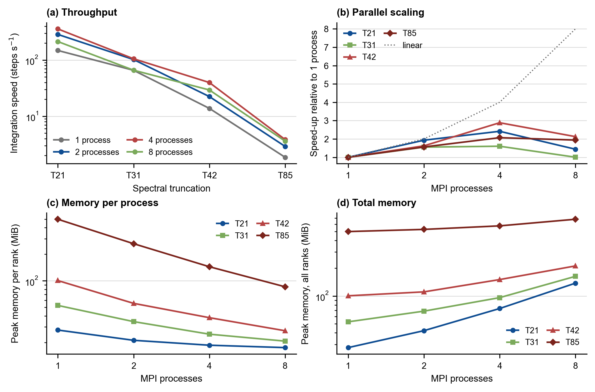

# 6.1 Speed and memory

*How long does a simulated year take, how much RAM does it need, and do more MPI
processes actually help? A rough capability reference for planning your own runs.*

You may have a concrete question before starting an experiment: *can I afford a
100-year T42 run on my laptop?*
This note answers those questions with a simple benchmark of the four standard
PlaSiC configurations at 1, 2, 4 and 8 MPI processes. It is not a formal,
hardware-independent performance study — it is a quick reference table so that
you can pick a resolution and a process count with realistic expectations.

Two quantities are measured:

- **Computing speed** — the steady-state integration rate in model steps per
  second, and the wall-clock time this implies per simulated year;
- **Memory use** — the peak physical memory (*resident set size*, RSS) each MPI
  process needs, and the total across all processes.

## 1. What we measured, and how to read it

### 1.1 Throughput: steady-state steps per second

A climate model run is not a single number-crunching task. It is a loop that,
at every step, computes dynamics, physics and the ocean, and occasionally reads
or writes files. Startup (reading the restart file, building transform tables)
and periodic I/O inflate the wall time of a short run, so measuring the total
shell command duration would underestimate the model's true integration speed.

Instead, PlaSiC writes a record after every step to `progress.txt`:

```json
{"completed_steps": 1, "total_steps": 48, "date": {"year": 0, "month": 2, "day": 1, "hour": 6, "minute": 45},
 "elapsed_seconds": 0.00407481194, "steps_per_second": 245.410099}
```

The benchmark takes the difference of `elapsed_seconds` between the first and
the last record of a 48-step run. This is the **steady-state rate** — the rate
that dominates a long simulation. Each configuration was run three times and the
best rate is reported.

### 1.2 Memory: peak resident set size per process

In an MPI run, each process (each *rank*) is a separate operating-system process
with its own memory. The number that matters for whether a job fits on a machine
is the **peak resident set size**: the largest amount of physical memory the
process used at any moment, as recorded by the operating system. It includes
model arrays, the executable and shared libraries, MPI communication buffers,
and — because the measurement run starts and finishes by reading and writing a
restart file — the restart buffers. On macOS this is obtained by wrapping each
rank with `/usr/bin/time -l`:

```
498.62 MiB  →  "maximum resident set size" of one T85 process
```

Total memory for a job is the sum over ranks; per-rank memory is what decides
whether the job fits on a laptop or per node of a cluster.

### 1.3 What these numbers are not

These measurements come from one laptop with one compiler and one MPI library
(Section 2). Absolute rates will differ on your machine. What transfers between machines is the *shape*: how cost grows with
resolution, how much memory a configuration needs, and where adding processes
stops helping.
Treat the numbers as orders of magnitude, not as guarantees.

## 2. Benchmark setup

| Item | Setting |
|---|---|
| Machine | Apple M5, 10 CPU cores (4 performance + 6 efficiency), 32 GiB RAM, macOS 27 |
| Compiler | Apple clang 17, `-O2`, C11, `-fno-fast-math` |
| MPI | Open MPI 5.0.9 (no CPU binding available on macOS, default scheduling) |
| Model | 3-D 16-level ocean, full physics, restarts from `src/data/earth_*.restart` |
| Speed runs | 48 steps × 3 repetitions, steady-state rate from `progress.txt` |
| Memory runs | 4 steps, peak RSS per rank from `/usr/bin/time -l` |

The four configurations are the standard PlaSiC build targets. The model derives
the time step automatically from `NLAT` (a shorter step is needed to remain
stable as the grid is refined), so higher resolutions cost twice: more grid
points per step *and* more steps per simulated day.

| Truncation | Build flags | Gaussian grid | Levels | Time step | Steps per simulated day |
|---|---|---|---|---|---|
| T21 | `NLAT=32 NLEV=10` | 64 × 32 | 10 | 45 min | 32 |
| T31 | `NLAT=48 NLEV=13` | 96 × 48 | 13 | 36 min | 40 |
| T42 | `NLAT=64 NLEV=16` | 128 × 64 | 16 | 30 min | 48 |
| T85 | `NLAT=128 NLEV=25` | 256 × 128 | 25 | 15 min | 96 |

All builds use `MPI=1` and the same `NPRO` as the number of processes launched.
MPI requires `NPRO` to divide `NLAT`, which all values above satisfy.
The MPI implementation is Open MPI (Gabriel et al., 2004), following the MPI standard
(MPI Forum, 2015).

## 3. Results



Fig. 6.1.1. **Benchmark summary.** 

### 3.1 Throughput and time step

Steady-state integration speed in steps per second (best of three runs);
milliseconds per step in parentheses:

| Truncation | 1 process | 2 processes | 4 processes | 8 processes |
|---|---:|---:|---:|---:|
| T21 | 148 (6.7 ms) | 286 (3.5 ms) | **358 (2.8 ms)** | 214 (4.7 ms) |
| T31 | 66 (15.2 ms) | 102 (9.8 ms) | **105 (9.5 ms)** | 66 (15.2 ms) |
| T42 | 13.8 (72 ms) | 22.4 (45 ms) | **39.8 (25 ms)** | 29.4 (34 ms) |
| T85 | 1.86 (537 ms) | 2.91 (344 ms) | **3.85 (260 ms)** | 3.61 (277 ms) |

Run-to-run spread was below about 5% for almost all configurations, with the
noisiest case (T21 at 4 processes) varying by 7% between repetitions.

Two patterns dominate. First, **resolution is expensive**: one step of T85
costs roughly 80 times as much as one step of T21, and because its time step is
three times shorter, a simulated year at T85 costs about **250 times** as much
as at T21. Second, on this 10-core laptop **4 processes is the sweet spot for
every resolution**; 8 processes is consistently slower (Section 3.2).

### 3.2 Does adding processes help?

Speed-up relative to one process, and the corresponding parallel efficiency
(speed-up divided by the number of processes):

| Truncation | 2 processes | 4 processes | 8 processes |
|---|---|---|---|
| T21 | 1.9× (97%) | 2.4× (60%) | 1.4× (18%) |
| T31 | 1.6× (78%) | 1.6× (40%) | 1.0× (13%) |
| T42 | 1.6× (81%) | 2.9× (72%) | 2.1× (27%) |
| T85 | 1.6× (78%) | 2.1× (52%) | 1.9× (24%) |

Speed-up is far from linear, for three reasons that are worth knowing because
they apply to every MPI climate model, not just PlaSiC:

1. **Some work is inherently serial.** The spectral transforms and parts of the
   semi-implicit solver involve global operations; every step also costs
   communication between ranks. This sets a hard upper bound (Amdahl, 1967).
2. **The problem may be too small to split.** T31 at 4 processes does not run
   meaningfully faster than at 2: there is simply not enough work per rank to
   hide the communication and overhead.
3. **Not all cores are equal, and this laptop cannot bind processes to cores.**
   The M5 has 4 performance and 6 efficiency cores. At 8 processes, half the
   ranks land on slow efficiency cores, and macOS Open MPI does not pin ranks to
   cores, so the scheduler may move them around. This is why 8 processes is
   slower than 4 here. On a cluster node with 8 or more identical, fast cores,
   the T42 and T85 curves would look different.

A useful practical rule from the table: **2 processes give a solid ~1.6–1.9×
speed-up for little effort; 4 processes is the practical maximum on this class
of machine; go beyond that only if you have verified a benefit on your own
hardware.**

### 3.3 What it means in simulated time

Simulated years that can be integrated per day of wall-clock time, and the wall
time needed for a 100-year simulation (the usual unit of a historical or
projection experiment). Values are the best configuration (4 processes) unless
noted:

| Truncation | Simulated years per day | Time per simulated year | Wall time for 100 simulated years |
|---|---:|---:|---:|
| T21 | 2 650 | 33 s | **≈ 0.9 hours** (4 procs) |
| T31 | 620 | 2.3 min | **≈ 3.9 hours** (4 procs) |
| T42 | 196 | 7.3 min | **≈ 12 hours** (4 procs) |
| T85 | 9.5 | 2.5 hours | **≈ 10.5 days** (4 procs) |


### 3.4 Memory

Peak memory per rank and the total over all ranks (MiB):

| Truncation | 1 process | 2 processes | 4 processes | 8 processes |
|---|---|---|---|---|
| T21 | 27.7 (27.7) | 21.2 (42.2) | 18.6 (73.3) | 17.5 (137.8) |
| T31 | 52.6 (52.6) | 34.5 (68.6) | 24.8 (96.1) | 20.7 (163.3) |
| T42 | 100.6 (100.6) | 55.5 (111.0) | 38.2 (150.7) | 27.2 (211.8) |
| T85 | 498.6 (498.6) | 263.4 (526.2) | 144.4 (574.8) | 85.6 (677.8) |

Format: *per rank (total)*.

The per-rank values follow a simple model, **per-rank memory ≈ fixed overhead +
grid arrays / N**, where the fixed overhead is what every rank needs regardless
of decomposition (executable, libraries, MPI buffers, global transform tables):

| Truncation | Fixed overhead | Grid arrays per rank (1 rank) | Fitted formula |
|---|---:|---:|---|
| T21 | ≈ 16 MiB | ≈ 12 MiB | 16 + 12/N MiB |
| T31 | ≈ 16 MiB | ≈ 37 MiB | 16 + 37/N MiB |
| T42 | ≈ 16 MiB | ≈ 84 MiB | 16 + 84/N MiB |
| T85 | ≈ 27 MiB | ≈ 470 MiB | 27 + 470/N MiB |

## 4. Rules of thumb

- **Resolution:** each doubling of the horizontal grid (T21 → T42 → T85)
  multiplies the cost of a simulated year by roughly 15–16×, i.e. about 250×
  from T21 to T85. Budget accordingly: what takes an hour at T21 takes about a
  week at T85.
- **Processes:** use 2–4 MPI processes on a laptop; 4 was optimal for every
  configuration here. More processes only help if the machine has enough fast
  cores and the problem is large enough to amortize communication.
- **Memory:** use the fitted formulas in Section 3.4 to estimate requirements,
  then add a safety margin of a few tens of percent.
- **Concurrency:** running one job with 4 processes is both faster and more
  memory-efficient than running 4 single-process jobs in parallel. If you need
  many experiments, queue them rather than launching them all at once.

---

## References

- Amdahl, G. M. (1967). Validity of the single processor approach to achieving large scale computing capabilities. In *Proceedings of the April 18–20, 1967, Spring Joint Computer Conference* (pp. 483–485). Association for Computing Machinery. [https://doi.org/10.1145/1465482.1465560](https://doi.org/10.1145/1465482.1465560)
- Gabriel, E., Fagg, G. E., Bosilca, G., Angskun, T., Dongarra, J. J., Squyres, J. M., Sahay, V., Kambadur, P., Barrett, B., Lumsdaine, A., Castain, R. H., Daniel, D. J., Graham, R. L., & Woodall, T. S. (2004). Open MPI: Goals, concept, and design of a next generation MPI implementation. In *Recent advances in parallel virtual machine and message passing interface* (Lecture Notes in Computer Science, Vol. 3241, pp. 97–104). Springer. [https://doi.org/10.1007/978-3-540-30218-6_19](https://doi.org/10.1007/978-3-540-30218-6_19)
- MPI Forum. (2015). *MPI: A message-passing interface standard, version 3.1*. [https://www.mpi-forum.org/docs/mpi-3.1/mpi31-report.pdf](https://www.mpi-forum.org/docs/mpi-3.1/mpi31-report.pdf)


