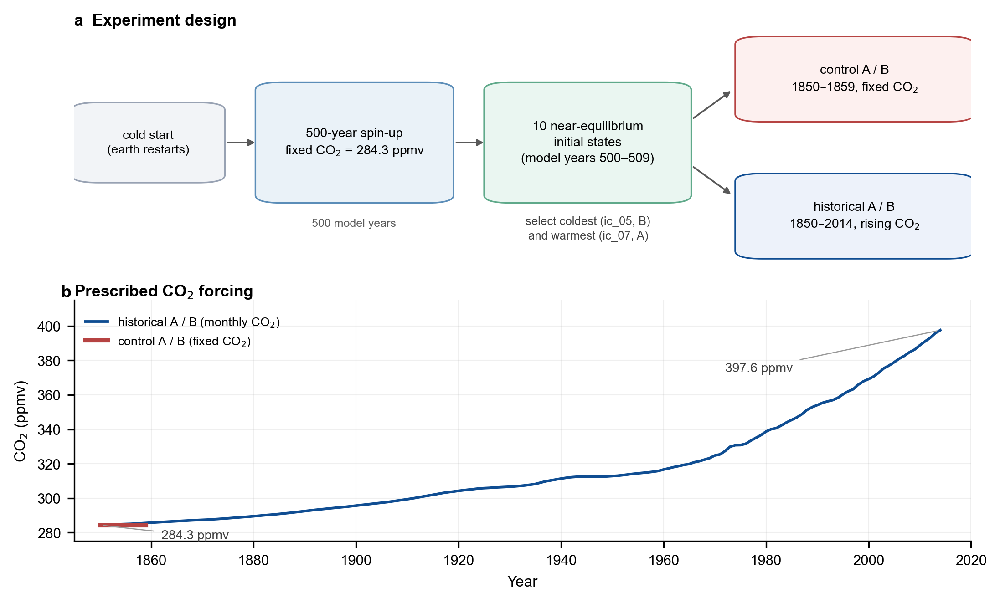
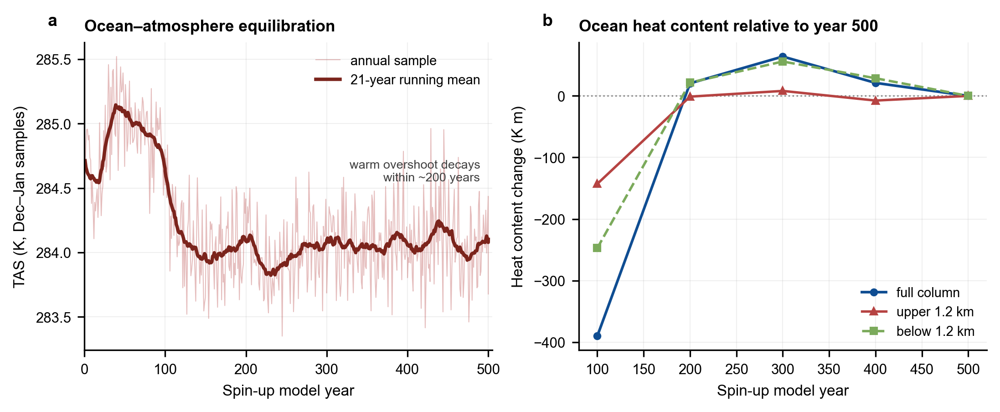
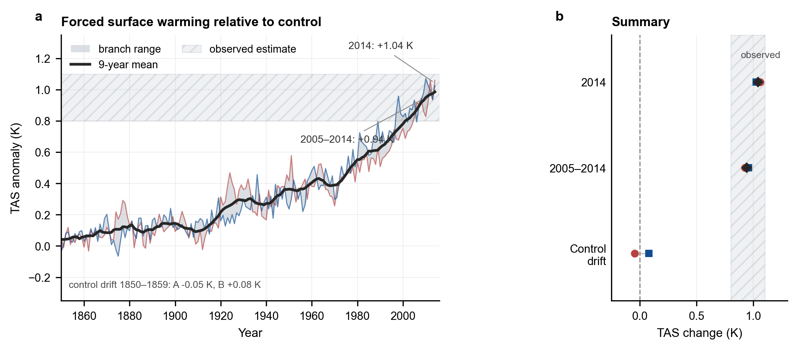
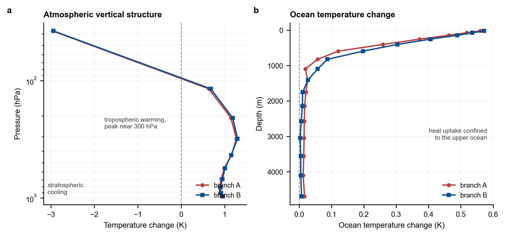
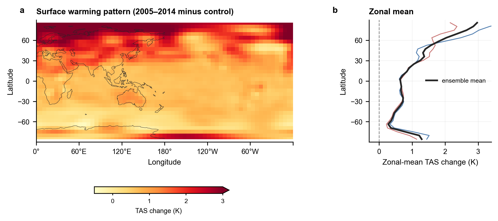
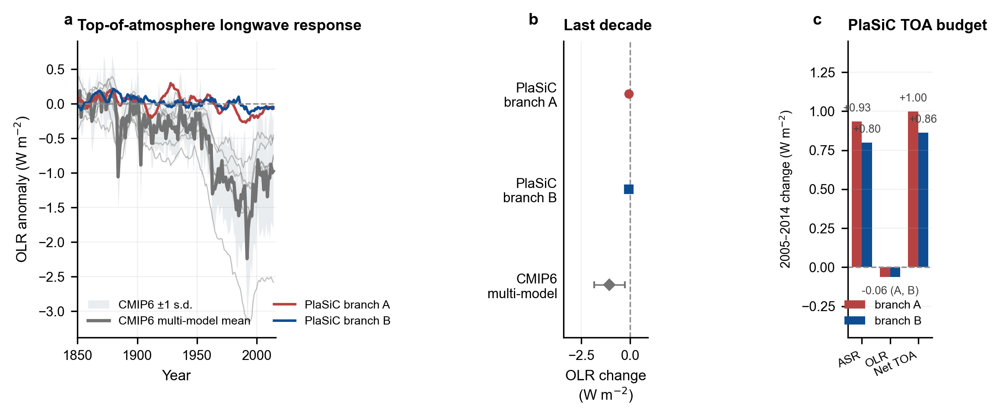

# 6.2 PlaSiC historical experiment (1850–2014) { #historical-experiment }

*Driven by observed CO₂, does the coupled model reproduce the climate change of the
industrial era — and does it do so for the right reasons?*

## 1. Why a historical experiment?

A model can only be trusted for future projections if it first reproduces the past.
The historical period is a demanding but well-posed test: the forcing is known
(atmospheric CO₂), the expected response is observed. The model used here is the
PlaSim lineage implemented in PlaSiC (Fraedrich et al., 2005).

This experiment is designed to answer three questions:

1. **Is the control climate balanced?** With the ocean at equilibrium, a ten-year
   run at constant 1850 CO₂ should not drift.
2. **Is the forced response realistic?** How much does global near-surface air
   temperature (TAS) warm by 2014, and how does that compare with observations?
3. **Are the simulated structures physical?** Is the warming vertically and
   spatially placed where physics puts it — stratospheric cooling with tropospheric
   warming, and ocean heat uptake concentrated near the surface?


## 2. Experiment design

### 2.1 Configuration

The experiment follows the CMIP6 historical-experiment framework (Eyring et al., 2016), although
only CO₂ is prescribed; the concentrations are taken from the CMIP6 historical greenhouse-gas
dataset (Meinshausen et al., 2017).

| Component | Setting |
|---|---|
| Atmosphere | T21 spectral truncation on a 64 × 32 Gaussian grid, 10 sigma levels |
| Ocean | 3-D, 16 levels; top level 50 m, deepest level centred near 4 695 m (≈ 5 000 m column) |
| Execution | 2 MPI processes; 45-minute time step, 32 steps per day (≈ 11 700 steps per year) |
| Build | `make -C src all MPI=1 NPRO=2 NLAT=32 NLEV=10` → `build/T21_L10_MPI_P2_O16/plasic.x` |
| Spin-up | 500 model years from `src/data/earth_t21_l10.restart`, CO₂ fixed at 284.3 ppmv |
| Initial states | `ic_00`–`ic_09` saved at model years 500–509; A = `ic_07` (warmest), B = `ic_05` (coldest) |
| Control runs | 1850–1859, CO₂ fixed at 284.3 ppmv; anomaly baseline 1855–1859 |
| Historical runs | 1850–2014, monthly CO₂ rising 284.3 → 397.6 ppmv |



Fig. 6.2.1. **Experimental set-up.** (a) A cold restart is integrated for 500 years at
pre-industrial CO₂, ten near-equilibrium states are saved, and the coldest and
warmest are used to initialise two parallel control and historical branches.
(b) The prescribed atmospheric CO₂: constant at 284.3 ppmv in the control, and
rising to 397.6 ppmv over 1850–2014 in the historical runs.

### 2.2 Why the ocean needs a 500-year spin-up

The atmosphere adjusts within weeks, but the deep ocean has a memory of centuries.
Starting the three-dimensional ocean from a cold restart leaves it far from
equilibrium with the atmosphere. The model then spends the first decades of the
experiment heating the ocean rather than responding to CO₂, which contaminates the
control baseline and produces a spurious early warm peak followed by relaxation in
the historical run.

The solution adopted here is to integrate the coupled model for **500 years** at
1850 CO₂ before any historical forcing is applied. The spin-up is run as five
100-year segments so that it can be monitored and restarted, saving
`spinup_y100.restart` … `spinup_y500.restart`. Only then are the initial states
for the historical experiment drawn from model years 500–509.

### 2.3 Two branches, one control baseline each

The ten saved states sample the model's residual internal variability. The two
extremes are selected:

- **Branch A** starts from `ic_07`, the warmest state (annual-mean TAS ≈ 284.07 K);
- **Branch B** starts from `ic_05`, the coldest state (≈ 283.59 K).

Each branch first performs a ten-year **control run** at constant 1850 CO₂; its
1855–1859 mean defines the anomaly baseline for that branch. The historical run
then restarts from the same state with the clock rebased to 1850-01-01
(`--reset-nstep`, see
[5.1 Calendar](../5-time-control/5.1-calendar.md)) and the
monthly CO₂ forcing switched on. Anomalies are always taken against the matching
control, so any residual model bias cancels to first order.

The full pipeline takes about **7–8 hours** on a modern laptop (≈ 5 h for the
500-year spin-up and ≈ 2.5 h for the four control and historical runs).

## 3. Results

### 3.1 The spin-up removes the initial shock



Fig. 6.2.2. **Equilibration during the 500-year spin-up.** (a) Surface air temperature
(the progress samples fall in December–January, so absolute values sit below the
annual mean; the trend is what matters). A warm overshoot of about +1 K decays
within roughly 200 years. (b) Ocean heat content relative to year 500. The upper
1.2 km stabilises after about 200 years; the full column drifts by less than
0.1 K of column-mean temperature after year 300.

Two features of the spin-up matter for the interpretation of the historical runs:

- The surface warm overshoot (Fig. 6.2.2a) is largest in the first ~100 years and then
  decays to a stable state. Without the spin-up, this drift would be attributed to
  CO₂ forcing in the historical run.
- The upper 1.2 km of the ocean reaches equilibrium first; the deeper layers
  exchange a small residual amount of heat (≲ 0.1 K of column mean) for a few
  hundred years before settling. The checkpoints in Fig. 6.2.2b are spaced 100 years,
  so they bound, rather than resolve, the exact adjustment time.

### 3.2 The control climate is stable

| Quantity (1850–1859) | Branch A | Branch B |
|---|---:|---:|
| Baseline TAS (1855–1859) / K | 286.97 | 287.00 |
| Ten-year control drift / K | **−0.05** | **+0.08** |

Compared with a ten-year ocean spin-up (drift about +0.3 K) or a slab ocean
(+1.6 K), the equilibrated control drifts by less than 0.1 K over a decade. This is
the single most important prerequisite for interpreting the forced response: the
model is not warming because it is still adjusting.

### 3.3 The forced surface warming matches observations



Fig. 6.2.3. **Global-mean surface temperature change.** (a) Annual anomalies relative to
each branch's 1855–1859 control, with thin lines for the two branches and a
bold nine-year mean of the ensemble. The hatched band is the range of observed
2005–2014 warming estimates from the standard GMST products relative to their
nineteenth-century baselines. (b) Summary: control drift, last-decade and 2014
anomalies.

The observed range is drawn from the standard global-mean surface temperature products
(HadCRUT5: Morice et al., 2021; GISTEMP: Lenssen et al., 2019; Berkeley Earth: Rohde &
Hausfather, 2020; NOAA: Vose et al., 2012).

| Anomaly (versus control) | Branch A | Branch B | Ensemble | Reference |
|---|---:|---:|---:|---:|
| 2005–2014 ΔTAS / K | +0.93 | +0.96 | **+0.94** | 0.8–1.1 (observed estimate) |
| 2014 ΔTAS / K | +1.06 | +1.02 | **+1.04** | ≈ 1 |


### 3.4 Vertical structure: stratospheric cooling and tropospheric warming



Fig. 6.2.4. **Vertical structure of the change (2005–2014 minus control).** (a) Atmospheric
temperature change as a function of pressure. (b) Ocean temperature change as a
function of depth.

The stratospheric-cooling/tropospheric-warming pattern seen in (a) is a robust feature of the
observed record (Intergovernmental Panel on Climate Change [IPCC], 2021).


### 3.5 Ocean heat uptake is surface-intensified

The ocean temperature change (Fig. 6.2.4b) decays rapidly with depth (branch A):

Warming is confined to roughly the upper 600 m; below about 1 km the change is
within a few hundredths of a kelvin. This is the expected pattern for a transient
warming: the ocean takes up heat at the surface and mixes it downward only slowly
(ocean heat uptake: Cheng et al., 2017; Earth's energy imbalance: Trenberth et al., 2014).

### 3.6 Large-scale spatial pattern



Fig. 6.2.5. **Spatial pattern of the 2005–2014 warming (ensemble mean minus control).**
(a) Surface map; (b) zonal mean, with the two branches shown as thin lines.

The warming is not uniform: it reaches ≈ +3 K in the Arctic zonal mean and ≈ +1.3
to +2 K over the northern mid-latitudes, while the tropics and most of the Southern
Ocean warm by only ≈ +0.4 to +0.9 K. This **polar amplification** and the
land–sea contrast are qualitatively consistent with observations
(Pithan & Mauritsen, 2014; Serreze & Barry, 2011).

### 3.7 The longwave caveat



Fig. 6.2.6. **Top-of-atmosphere radiation response.** (a) Outgoing longwave radiation
(OLR) anomalies for PlaSiC and for six CMIP6 historical simulations, all relative
to 1850–1859. Thin grey lines are individual CMIP6 models; the dark line is the
multi-model mean with ±1 s.d. (b) The 2005–2014 OLR change. (c) PlaSiC's
last-decade TOA budget: absorbed shortwave (ASR), OLR and their sum, the net TOA
imbalance.

This is the one place where the experiment gives an answer that needs more work.
PlaSiC's OLR changes by only **−0.06 W m⁻²** over the last decade, whereas the
CMIP6 models used here (BCC-CSM2-MR: Wu et al., 2019; CESM2: Danabasoglu et al., 2020;
CESM2-WACCM: Gettelman et al., 2019; FGOALS-f3-L: He et al., 2019; GFDL-CM4: Held et al., 2019;
MRI-ESM2-0: Yukimoto et al., 2019) give a multi-model mean of about **−1.1 W m⁻²**. The model is not
radiatively inert, however: panel (c) shows that the net TOA imbalance,
ΔASR − ΔOLR ≈ **+0.9 W m⁻²**, is carried almost entirely by an increase in
absorbed shortwave radiation (+0.8 to +0.9 W m⁻²), consistent with a warming
ocean taking up heat.

In other words, the total energy budget is plausible, but its **partitioning
between shortwave and longwave differs from CMIP6**. Part of the difference is
expected: the CMIP6 runs include aerosols and volcanic eruptions, while PlaSiC is
driven by CO₂ alone. Whether the remainder is a genuine cloud/water-vapour
feedback in this model or an artifact of the radiation parameterization — the
interactive scheme is described in
[3.4 Radiation Parameterization](<../3-parameterizations/3.4-radiation-parameterization.md>) — is the main follow-up question
raised by this experiment.

## 4. Reproducing the experiment

```bash
# Build the coupled model (2 MPI processes, T21/L10, 16-level ocean)
make -C src all MPI=1 NPRO=2 NLAT=32 NLEV=10

# Run the whole pipeline (≈ 7–8 hours); restartable at every stage
bash historical_3d_500y/run_pipeline.sh all

# Or stage by stage
bash historical_3d_500y/run_pipeline.sh spinup
bash historical_3d_500y/run_pipeline.sh historical

# Analysis, summary tables and the figures in this note
python historical_3d_500y/analyze.py
python historical_3d_500y/make_docs_figures.py
```

The pipeline skips any segment or experiment whose output already exists, so an
interrupted run can be resumed with the same command.

---

## References

- Cheng, L., Trenberth, K. E., Fasullo, J., Boyer, T., Abraham, J., & Zhu, J. (2017). Improved estimates of ocean heat content from 1960 to 2015. *Science Advances*, *3*(3), e1601545. [https://doi.org/10.1126/sciadv.1601545](https://doi.org/10.1126/sciadv.1601545)
- Danabasoglu, G., Lamarque, J.-F., Bacmeister, J., Bailey, D. A., DuVivier, A. K., Edwards, J., Emmons, L. K., Fasullo, J., Garcia, R., Gettelman, A., Hannay, C., Holland, M. M., Large, W. G., Lauritzen, P. H., Lawrence, D. M., Lenaerts, J. T. M., Lindsay, K., Lipscomb, W. H., Mills, M. J., … Strand, W. G. (2020). The Community Earth System Model Version 2 (CESM2). *Journal of Advances in Modeling Earth Systems*, *12*(2), e2019MS001916. [https://doi.org/10.1029/2019MS001916](https://doi.org/10.1029/2019MS001916)
- Eyring, V., Bony, S., Meehl, G. A., Senior, C. A., Stevens, B., Stouffer, R. J., & Taylor, K. E. (2016). Overview of the Coupled Model Intercomparison Project Phase 6 (CMIP6) experimental design and organization. *Geoscientific Model Development*, *9*(5), 1937–1958. [https://doi.org/10.5194/gmd-9-1937-2016](https://doi.org/10.5194/gmd-9-1937-2016)
- Fraedrich, K., Jansen, H., Kirk, E., Luksch, U., & Lunkeit, F. (2005). The Planet Simulator: Towards a user friendly model. *Meteorologische Zeitschrift*, *14*(3), 299–304. [https://doi.org/10.1127/0941-2948/2005/0043](https://doi.org/10.1127/0941-2948/2005/0043)
- Gettelman, A., Mills, M. J., Kinnison, D. E., Garcia, R. R., Smith, A. K., Marsh, D. R., Tilmes, S., Vitt, F., Bardeen, C. G., McInerny, J., Liu, H.-L., Solomon, S. C., Polvani, L. M., Emmons, L. K., Lamarque, J.-F., Richter, J. H., Glanville, A. S., Bacmeister, J. T., Phillips, A. S., … Randel, W. J. (2019). The Whole Atmosphere Community Climate Model Version 6 (WACCM6). *Journal of Geophysical Research: Atmospheres*, *124*(23), 12380–12403. [https://doi.org/10.1029/2019JD030943](https://doi.org/10.1029/2019JD030943)
- He, B., Bao, Q., Wang, X., Zhou, L., Wu, X., Liu, Y., Wu, G., Chen, K., He, S., Hu, W., Li, J., Li, J., Nian, G., Wang, L., Yang, J., Zhang, M., & Zhang, X. (2019). CAS FGOALS-f3-L model datasets for CMIP6 historical Atmospheric Model Intercomparison Project simulation. *Advances in Atmospheric Sciences*, *36*(8), 771–778. [https://doi.org/10.1007/s00376-019-9027-8](https://doi.org/10.1007/s00376-019-9027-8)
- Held, I. M., Guo, H., Adcroft, A., Dunne, J. P., Horowitz, L. W., Krasting, J., Shevliakova, E., Winton, M., Zhao, M., Bushuk, M., Wittenberg, A. T., Wyman, B., Xiang, B., Zhang, R., Anderson, W., Balaji, V., Donner, L., Dunne, K., Durachta, J., … Zadeh, N. (2019). Structure and performance of GFDL's CM4.0 climate model. *Journal of Advances in Modeling Earth Systems*, *11*(11), 3691–3727. [https://doi.org/10.1029/2019MS001829](https://doi.org/10.1029/2019MS001829)
- Intergovernmental Panel on Climate Change (IPCC). (2021). *Climate change 2021: The physical science basis. Contribution of Working Group I to the Sixth Assessment Report of the Intergovernmental Panel on Climate Change* (V. Masson-Delmotte, P. Zhai, A. Pirani, S. L. Connors, C. Péan, S. Berger, N. Caud, Y. Chen, L. Goldfarb, M. I. Gomis, M. Huang, K. Leitzell, E. Lonnoy, J. B. R. Matthews, T. K. Maycock, T. Waterfield, O. Yelekçi, R. Yu, & B. Zhou, Eds.). Cambridge University Press. [https://doi.org/10.1017/9781009157896](https://doi.org/10.1017/9781009157896)
- Lenssen, N. J. L., Schmidt, G. A., Hansen, J. E., Menne, M. J., Persin, A., Ruedy, R., & Zyss, D. (2019). Improvements in the GISTEMP uncertainty model. *Journal of Geophysical Research: Atmospheres*, *124*(12), 6307–6326. [https://doi.org/10.1029/2018JD029522](https://doi.org/10.1029/2018JD029522)
- Meinshausen, M., Vogel, E., Nauels, A., Lorbacher, K., Meinshausen, N., Etheridge, D. M., Fraser, P. J., Montzka, S. A., Rayner, P. J., Trudinger, C. M., Krummel, P. B., Beyerle, U., Canadell, J. G., Daniel, J. S., Enting, I. G., Law, R. M., Lunder, C. R., O'Doherty, S., Prinn, R. G., … Weiss, R. (2017). Historical greenhouse gas concentrations for climate modelling (CMIP6). *Geoscientific Model Development*, *10*(5), 2057–2116. [https://doi.org/10.5194/gmd-10-2057-2017](https://doi.org/10.5194/gmd-10-2057-2017)
- Morice, C. P., Kennedy, J. J., Rayner, N. A., Winn, J. P., Hogan, E., Killick, R. E., Dunn, R. J. H., Osborn, T. J., Jones, P. D., & Simpson, I. R. (2021). An updated assessment of near-surface temperature change from 1850: The HadCRUT5 data set. *Journal of Geophysical Research: Atmospheres*, *126*(3), e2019JD032361. [https://doi.org/10.1029/2019JD032361](https://doi.org/10.1029/2019JD032361)
- Pithan, F., & Mauritsen, T. (2014). Arctic amplification dominated by temperature feedbacks in contemporary climate models. *Nature Geoscience*, *7*(3), 181–184. [https://doi.org/10.1038/ngeo2071](https://doi.org/10.1038/ngeo2071)
- Rohde, R. A., & Hausfather, Z. (2020). The Berkeley Earth land/ocean temperature record. *Earth System Science Data*, *12*(4), 3469–3479. [https://doi.org/10.5194/essd-12-3469-2020](https://doi.org/10.5194/essd-12-3469-2020)
- Serreze, M. C., & Barry, R. G. (2011). Processes and impacts of Arctic amplification: A research synthesis. *Global and Planetary Change*, *77*(1–2), 85–96. [https://doi.org/10.1016/j.gloplacha.2011.03.004](https://doi.org/10.1016/j.gloplacha.2011.03.004)
- Trenberth, K. E., Fasullo, J. T., & Balmaseda, M. A. (2014). Earth's energy imbalance. *Journal of Climate*, *27*(9), 3129–3144. [https://doi.org/10.1175/JCLI-D-13-00294.1](https://doi.org/10.1175/JCLI-D-13-00294.1)
- Vose, R. S., Arndt, D., Banzon, V. F., Easterling, D. R., Gleason, B., Huang, B., Kearns, E., Lawrimore, J. H., Menne, M. J., Peterson, T. C., Reynolds, R. W., Smith, T. M., Williams, C. N., & Wuertz, D. B. (2012). NOAA's merged land–ocean surface temperature analysis. *Bulletin of the American Meteorological Society*, *93*(11), 1677–1685. [https://doi.org/10.1175/BAMS-D-11-00241.1](https://doi.org/10.1175/BAMS-D-11-00241.1)
- Wu, T., Lu, Y., Fang, Y., Xin, X., Li, L., Li, W., Jie, W., Zhang, J., Liu, Y., Zhang, L., Zhang, F., Zhang, Y., Wu, F., Li, J., Chu, M., Wang, Z., Shi, X., Liu, X., Wei, M., … Liu, X. (2019). The Beijing Climate Center Climate System Model (BCC-CSM): The main progress from CMIP5 to CMIP6. *Geoscientific Model Development*, *12*(4), 1573–1600. [https://doi.org/10.5194/gmd-12-1573-2019](https://doi.org/10.5194/gmd-12-1573-2019)
- Yukimoto, S., Kawai, H., Koshiro, T., Oshima, N., Yoshida, K., Urakawa, S., Tsujino, H., Deushi, M., Tanaka, T., Hosaka, M., Yabu, S., Yoshimura, H., Shindo, E., Mizuta, R., Obata, A., Adachi, Y., & Ishii, M. (2019). The Meteorological Research Institute Earth System Model version 2.0, MRI-ESM2.0: Description and basic evaluation of the physical component. *Journal of the Meteorological Society of Japan*, *97*(5), 931–965. [https://doi.org/10.2151/jmsj.2019-051](https://doi.org/10.2151/jmsj.2019-051)

