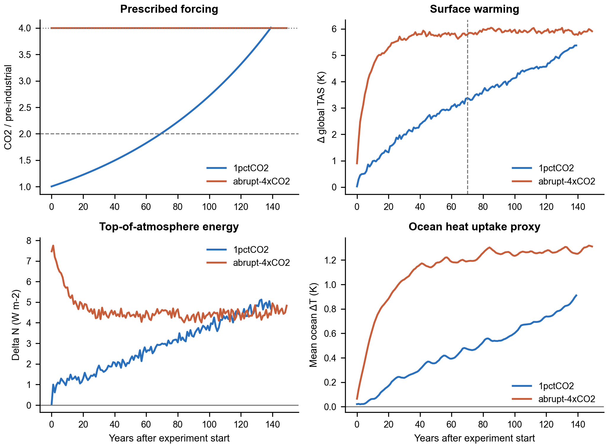
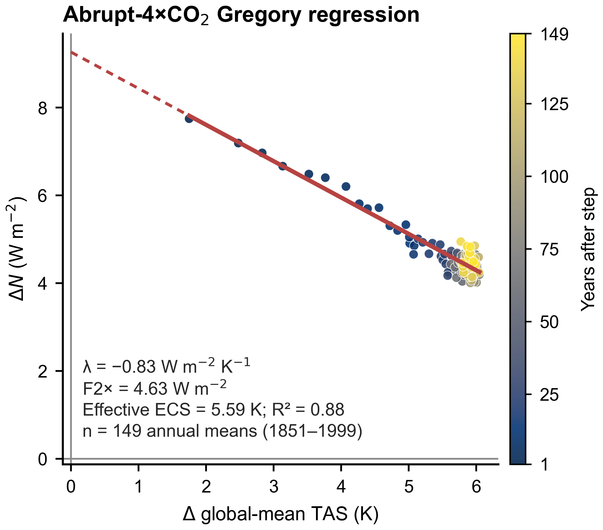
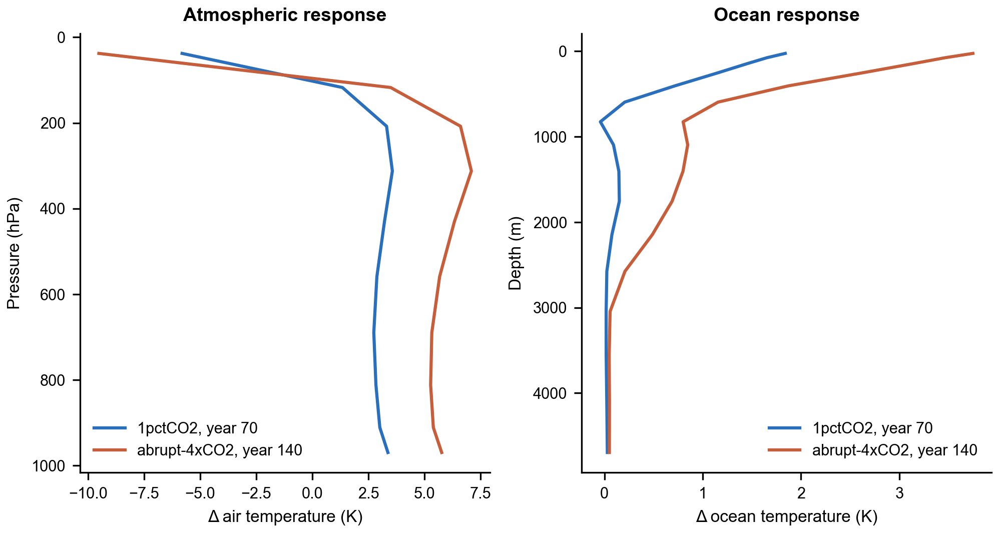
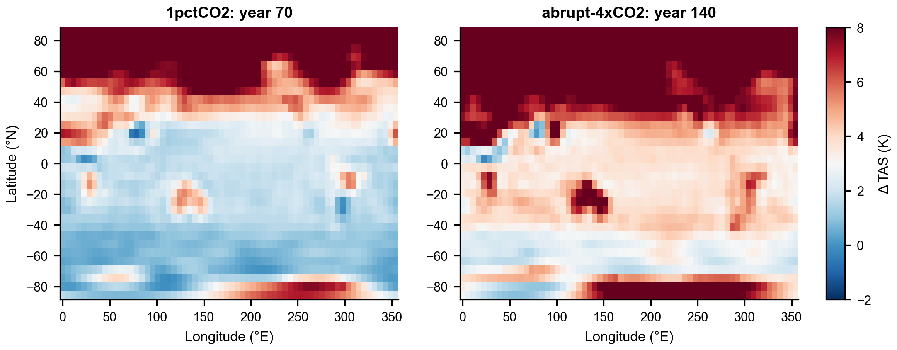
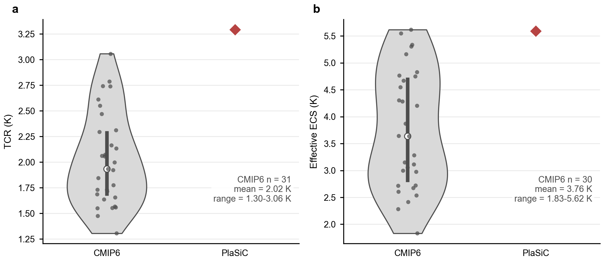

# 6.3 1pctCO₂ and abrupt-4×CO₂ experiments { #co2-sensitivity-experiments }

The CMIP6 DECK includes two idealized experiments that isolate the climate response to prescribed CO₂: `1pctCO2` and `abrupt-4xCO2`. PlaSiC runs both with a coupled ocean, using the same equilibrated initial state and control baseline.

## 1. Experimental design

| Component | PlaSiC setting |
|---|---|
| Atmosphere | T21; 64 × 32 Gaussian grid; 10 σ levels |
| Ocean | 50 m mixed layer coupled to a 16-level three-dimensional ocean |
| Integration | 45 min per step; 32 steps per day; Gregorian calendar |
| Initial state | Branch A from the 500-year, fixed-CO₂ ocean spin-up |
| Reference | 1850–1859 fixed-CO₂ control mean; pre-industrial CO₂ = 284.316853 ppm |
| Forcing | Prescribed, spatially uniform CO₂ only; no other time-varying forcing |
| `1pctCO2` | CO₂ rises by 1% yr⁻¹, compounded monthly, for 140 years; it reaches approximately 4× the initial concentration |
| `abrupt-4xCO2` | CO₂ is stepped immediately to 4× (about 1,137 ppm) and held there for 150 years |
| Output | One model member; monthly fields |

For the gradual experiment, the prescribed concentration is approximately

$$
C(t) = C_0(1.01)^t,
$$

where $t$ is elapsed time in years. It doubles after about 70 years. The abrupt experiment applies the same eventual 4× concentration at the start, so the ocean initially takes up heat much faster.



Fig. 6.3.1. **Global response to prescribed CO₂.** The gradual forcing produces a steady warming; the abrupt forcing causes a large initial energy imbalance and rapid early warming. The ocean warms more slowly than the surface.

## 2. How are TCR and ECS calculated?

First calculate annual global means and anomalies relative to the control. In PlaSiC, the control baseline is the 1850–1859 mean. Let $\Delta T$ be the change in global-mean near-surface air temperature (`tas`) and let $\Delta N$ be the change in net downward top-of-atmosphere (TOA) radiation, $\Delta N = \Delta rsdt - \Delta rsut - \Delta rlut$.

### Transient Climate Response (TCR)

TCR measures warming while CO₂ is still rising. In the standard `1pctCO2` protocol, it is the 20-year mean temperature anomaly over years 61–80, centred near the time CO₂ doubles:

$$
\mathrm{TCR} = \frac{1}{20}\sum_{y=61}^{80} \Delta T_y.
$$

Because the ocean has not equilibrated, TCR reflects both climate feedbacks and continuing ocean heat uptake. The CMIP6 reference table below uses this 61–80-year definition.

The local annual arrays label 1850 as relative year 0, so the analysis script selects relative years 60–79 (calendar years 1910–1929). These are the protocol's years 61–80.

### Equilibrium Climate Sensitivity (ECS)

ECS is the equilibrium global warming after a doubling of CO₂. The `abrupt-4xCO2` run is not long enough to reach equilibrium, so an *effective* ECS is estimated with a Gregory regression. The run covers 1850–1999, but the current analysis excludes the first annual mean and regresses the 149 annual means from 1851–1999:

$$
\Delta N = F_{4\times} + \lambda\Delta T,
\qquad
\mathrm{ECS}_{\mathrm{eff}} = -\frac{F_{4\times}}{2\lambda}.
$$

Here $F_{4\times}$ is the fitted intercept (effective forcing for 4×CO₂), and $\lambda$ is the fitted feedback slope, normally negative. Setting $\Delta N=0$ gives the extrapolated equilibrium warming for 4×CO₂, $-F_{4\times}/\lambda$; dividing by two gives the warming for one CO₂ doubling. Because the regression uses a transient response, its effective ECS can depend on the years fitted and on the evolving warming pattern.

The figure labels the halved intercept, $F_{2\times}=F_{4\times}/2$, which is about 4.63 W m⁻² for this 149-point fit.



Fig. 6.3.2. **Gregory regression.** Each point is one of the 149 annual means from 1851–1999. The fitted line is extrapolated to zero TOA imbalance to estimate the 4× equilibrium warming.

## 3. PlaSiC results

| Diagnostic | PlaSiC result | Interpretation |
|---|---:|---|
| TCR (`1pctCO2`) | 3.29 K | 20-year mean for relative years 60–79 (calendar years 1910–1929; protocol years 61–80) |
| `1pctCO2` warming in year 140 | 5.37 K | Final model year (1989); CO₂ is approximately 4× its initial concentration |
| `abrupt-4xCO2` warming in year 150 | 5.91 K | Final model year (1999); the surface continues to warm during the run |
| Gregory intercept, $F_{4\times}$ | 9.27 W m⁻² | Effective forcing inferred from the 1851–1999 regression |
| Gregory slope, $\lambda$ | −0.829 W m⁻² K⁻¹ | Negative feedback slope, as expected for a stabilizing climate response |
| Effective ECS | 5.59 K | From the 149-point 1851–1999 regression; $R^2=0.884$ |

The Gregory method therefore extrapolates beyond the simulated temperatures rather than treating the final-year warming as ECS. The vertical response also shows tropospheric warming, stratospheric cooling and ocean warming that weakens with depth. At T21 resolution, regional map details are diagnostic only.



Fig. 6.3.3. **Vertical response.** Profiles are from year 70 of `1pctCO2` and year 140 of `abrupt-4xCO2`. The troposphere warms while the stratosphere cools; ocean warming is concentrated near the surface and penetrates downward over time.



Fig. 6.3.4. **Arctic amplification effect.**

## 4. CMIP6 model-level reference data

The table reproduces the model-level diagnostics in the public [`tcr_cmip6.csv`](https://github.com/mark-ringer/cmip6/blob/master/tcr_cmip6.csv) and [`gregory_plot_cmip6.csv`](https://github.com/mark-ringer/cmip6/blob/master/gregory_plot_cmip6.csv) files. These are processed global-mean diagnostics, not raw CMIP6 NetCDF output. The repository removes the matching `piControl` trend from its experiment anomalies, whereas PlaSiC uses the fixed 1850–1859 control mean. TCR comes from the `1pctCO2` experiment; the CMIP6 ECS values use the standard 150-year Gregory regression, whereas the PlaSiC value above uses 149 annual means from 1851–1999. Values are shown to 0.001 K. An em dash means ECS is not listed for that model.

| CMIP6 model | TCR (K) | Effective ECS (K) |
|---|---:|---:|
| BCC-CSM2-MR | 1.730 | 3.056 |
| BCC-ESM1 | 1.777 | 3.282 |
| CAMS-CSM1-0 | 1.688 | 2.282 |
| CESM2-WACCM | 1.999 | 4.748 |
| CESM2 | 2.072 | 5.160 |
| CNRM-CM6-1-HR | 2.471 | 4.284 |
| CNRM-CM6-1 | 2.135 | 4.829 |
| CNRM-ESM2-1 | 1.845 | 4.764 |
| CanESM5 | 2.740 | 5.616 |
| E3SM-1-0 | 3.058 | 5.306 |
| EC-Earth3-Veg | 2.612 | 4.305 |
| EC-Earth3 | 2.311 | 4.205 |
| FGOALS-f3-L | 2.063 | 2.996 |
| GFDL-CM4 | 2.056 | 3.873 |
| GFDL-ESM4 | 1.566 | 2.721 |
| GISS-E2-1-G | 1.731 | 2.719 |
| GISS-E2-1-H | 1.924 | 3.112 |
| GISS-E2-2-G | 1.715 | 2.413 |
| HadGEM3-GC31-LL | 2.552 | 5.546 |
| INM-CM4-8 | 1.305 | 1.831 |
| IPSL-CM6A-LR | 2.294 | 4.546 |
| MCM-UA-1-0 | 1.933 | 3.637 |
| MIROC-ES2L | 1.554 | 2.676 |
| MIROC6 | 1.552 | 2.607 |
| MPI-ESM1-2-HR | 1.657 | 2.976 |
| MRI-ESM2-0 | 1.636 | 3.151 |
| NESM3 | 2.743 | 4.668 |
| NorCPM1-LM | 1.559 | — |
| NorESM2-LM | 1.476 | 2.537 |
| SAM0-UNICON | 2.166 | 3.641 |
| UKESM1-0-LL | 2.786 | 5.337 |

The reference sample has 31 TCR values (mean 2.023 K; range 1.305–3.058 K) and 30 ECS values (mean 3.761 K; range 1.831–5.616 K). PlaSiC's TCR (3.29 K) is above this sample's maximum, while its 149-year effective ECS (5.59 K) is just below the sample maximum.



Fig. 6.3.5. **Sensitivity comparison.** Grey points are individual CMIP6 models; red diamonds show PlaSiC. The CMIP6 sample and the values in the table use the same source diagnostics.

## 5. Reproducing the experiments

From the repository root, run:

```bash
bash experiments/co2_4xCO2_1pctCO2/run_experiments.sh
python3 experiments/co2_4xCO2_1pctCO2/analysis/analyze.py
```

## References

- Eyring, V., et al. (2016). Overview of the Coupled Model Intercomparison Project Phase 6 (CMIP6) experimental design and organization. *Geoscientific Model Development*, *9*, 1937–1958. [https://doi.org/10.5194/gmd-9-1937-2016](https://doi.org/10.5194/gmd-9-1937-2016)
- Gregory, J. M., et al. (2004). A new method for diagnosing radiative forcing and climate sensitivity. *Geophysical Research Letters*, *31*, L03205. [https://doi.org/10.1029/2003GL018747](https://doi.org/10.1029/2003GL018747)
- Ringer, M. (n.d.). *CMIP6 global-mean data and analysis*. [GitHub repository](https://github.com/mark-ringer/cmip6) (CC BY-SA 4.0). See the [README](https://github.com/mark-ringer/cmip6#readme) and the linked diagnostic CSV files above.
