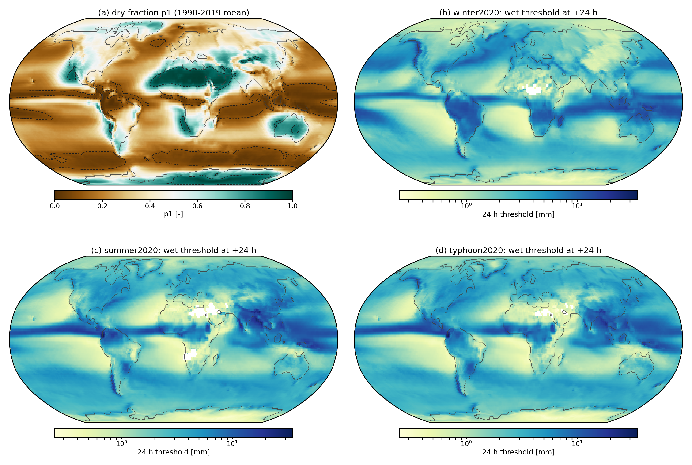
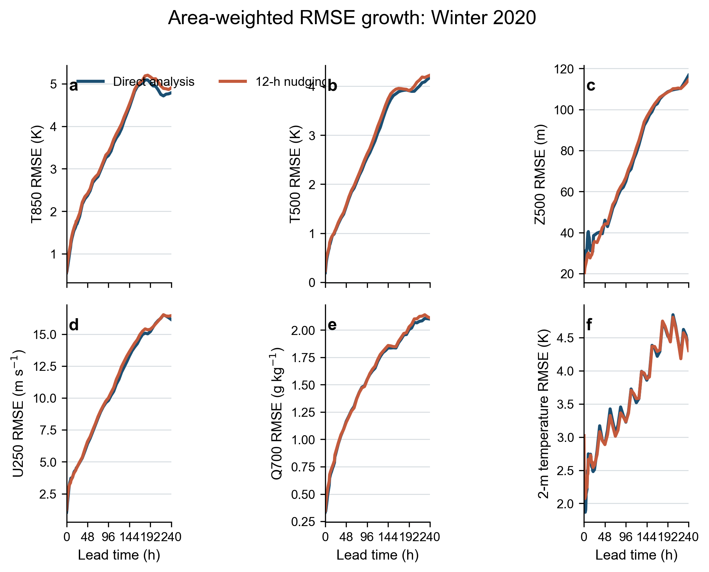
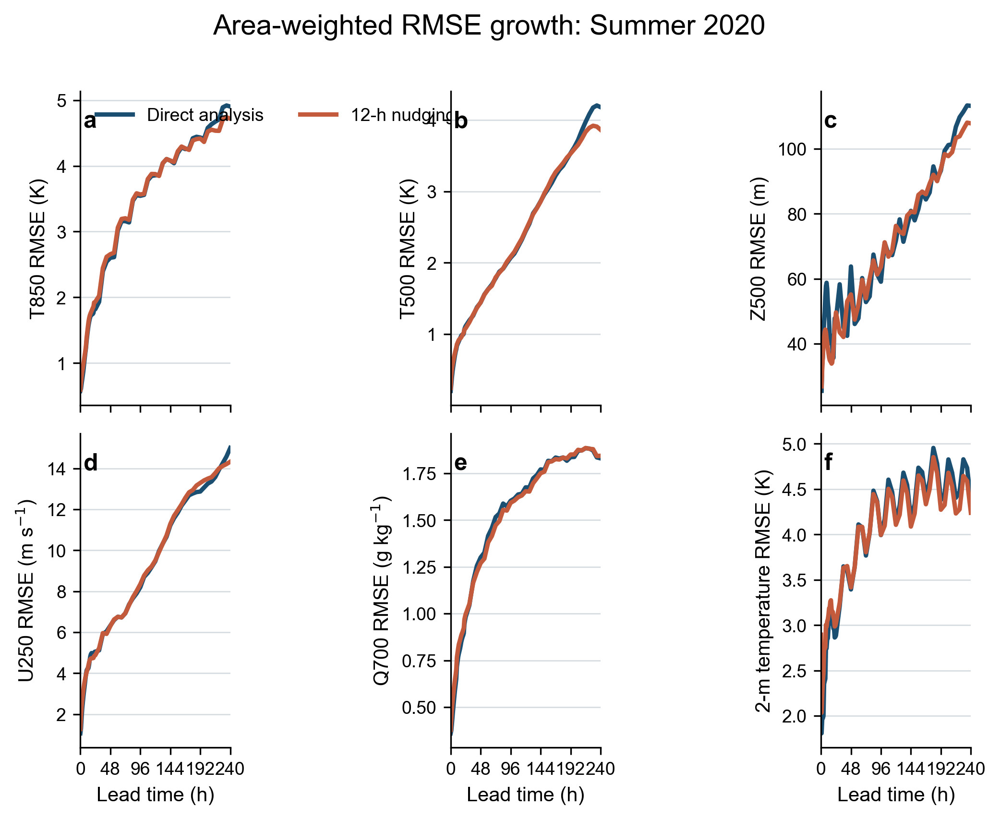
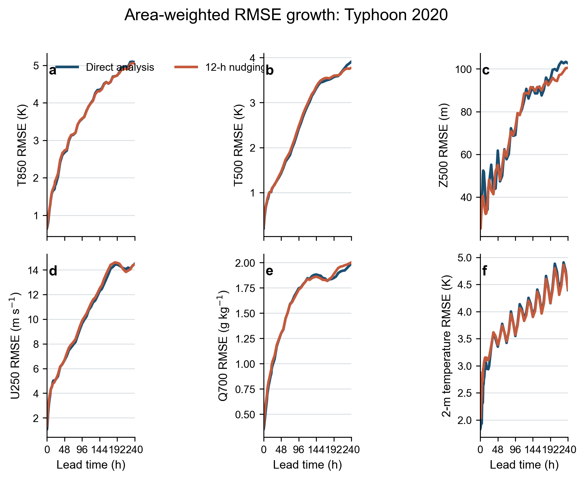
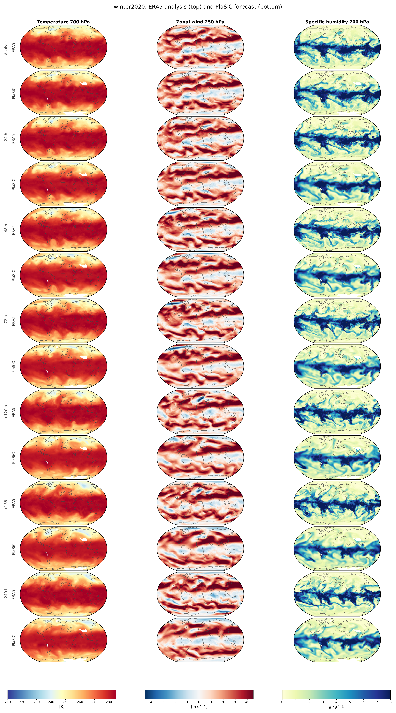
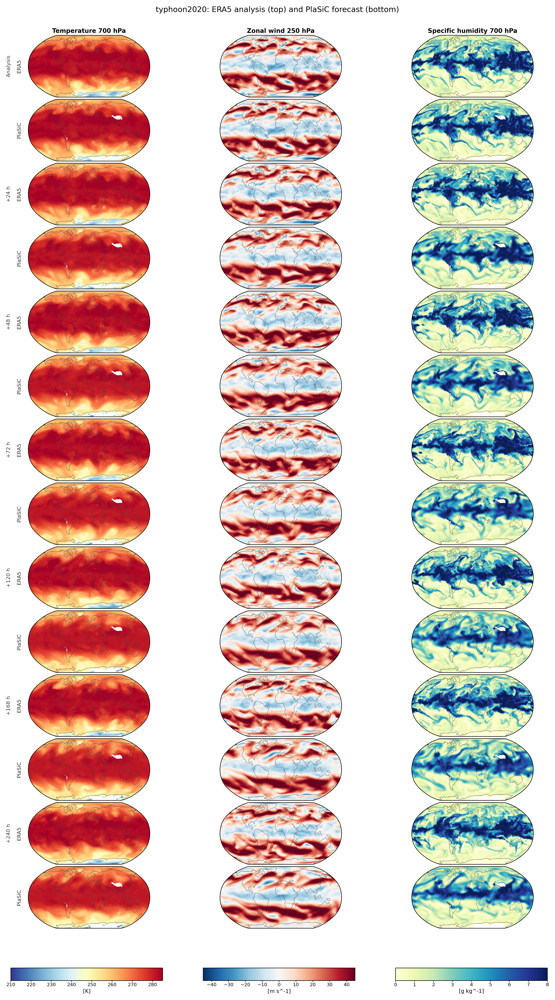
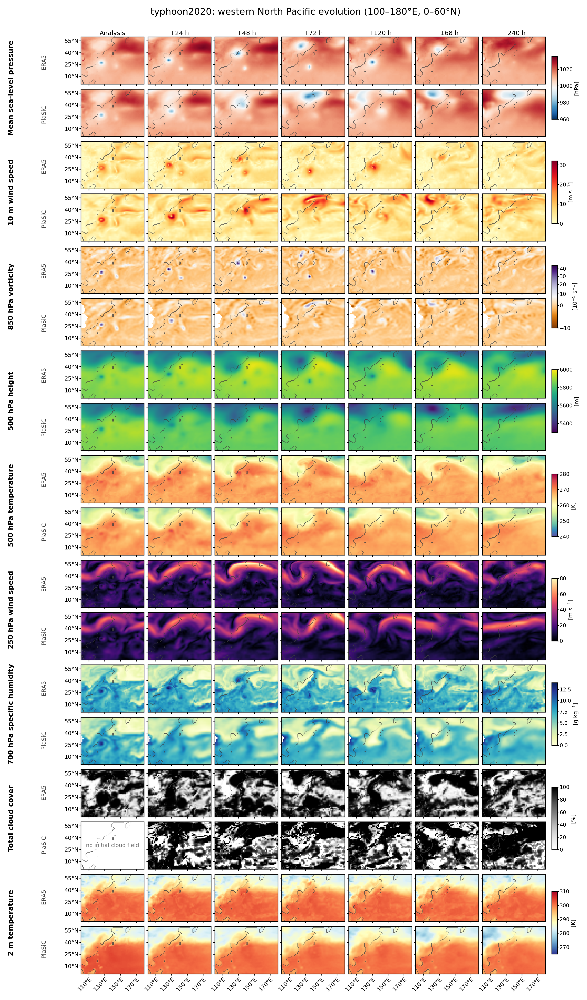

# 6.6 ERA5-initialized 10-day forecasts { #era5-forecast-experiment }

This experiment asks a simple question: **how long can PlaSiC preserve the large-scale atmospheric state in an ERA5-initialized free forecast?** The model is integrated for 10 days at T85/L25 and compared with ERA5 at matching valid times. 

## Experimental design

PlaSiC uses a 128 × 256 Gaussian grid, 25 stretched sigma levels and a 15-minute dynamical time step (96 steps per day). Each forecast has two output segments:

- **0–24 h:** save one frame every hour. This resolves the startup adjustment and provides 24 hourly forecast states after the analysis time.
- **24–240 h:** save one frame every 6 h. The 24 h state is already present in the first segment, so the second segment adds 36 frames at +30, +36, …, +240 h.

The cases cover a winter mid-latitude flow (`winter2020`), a summer circulation (`summer2020`) and Typhoon Maysak (`typhoon2020`). Two initial states are compared:

- **Direct analysis:** the regridded ERA5 state at the start time is written to both leapfrog levels.
- **Nudged analysis:** a 12-hour initialization window is integrated in 1-hour cycles. The atmospheric state uses an e-folding time of 1 h and the slowly varying surface reservoirs use 24 h. Only the current leapfrog level is relaxed; the old level keeps the model tendency.

### How the nudged analysis is constructed

The forecast start time is denoted by `t0`. The nudged run begins at `t0 − 12 h`, using the mapped ERA5 state at that earlier time. Each cycle advances the model by one hour (four 15-minute model steps), then moves its state part of the way toward the mapped ERA5 analysis at the end of that hour. This alternation lets the model evolve under its own dynamics while keeping it close to the analysis throughout the initialization window.

The atmospheric update acts on the restart coefficients for temperature, vorticity, divergence, humidity and log surface pressure. Surface reservoirs, including sea-surface temperature, soil temperature, soil water, snow and sea ice, are relaxed separately. PlaSiC's leapfrog scheme stores both a current state and a previous state to calculate the next step. Only the current atmospheric level is relaxed; the previous level produced by the model is retained.

For a model value `x_model`, target `x_ERA5`, time step `Δt` and relaxation time `τ`, the update is

```text
gamma = exp(-Δt / τ)
x_new = x_ERA5 + gamma × (x_model − x_ERA5)
```

With `Δt = 1 h`, `τ = 1 h` retains 36.8% of the atmospheric model–analysis difference and removes 63.2% at each cycle. The slower `τ = 24 h` surface update retains 95.9% and removes 4.1%.

The 12-hour procedure used by `run_forecasts.py:nudged_ic` is:

```text
analysis_start = mapped_ERA5(t0 − 12 h)
state = restart(current=analysis_start, previous=analysis_start)

for hour = 1, 2, …, 12:
    state_after_step = advance_one_hour(state)
    target = mapped_ERA5(t0 − 12 h + hour × 1 h)
    state_atmosphere = relax(state_after_step.atmosphere, target.atmosphere, Δt=1 h, τ=1 h)
    state_surface = relax(state_after_step.surface, target.surface, Δt=1 h, τ=24 h)
    state = replace_current_level(state_after_step, state_atmosphere, state_surface)
    # The old leapfrog level inside state_after_step is retained.

forecast_state = state  # at t0; turn nudging off for the free forecast
```

### Mapping ERA5 into PlaSiC

ERA5 pressure-level fields are first interpolated horizontally from the 1.5° regular grid to the T85 Gaussian grid. Surface pressure is corrected to the smoother PlaSiC orography with a hydrostatic adjustment,

```text
p_surface(model) = p_surface(ERA5) × exp[-(z_model − z_ERA5)/(R_d T_mean)].
```

Temperature, wind and specific humidity are then interpolated in log pressure onto the 25 sigma layers. Humidity is clipped to a physical range. Surface temperature, sea-surface temperature, sea ice, soil temperature, soil water and snow are initialized from the ERA5 single-level data, with model-consistent bounds for ice and land reservoirs.

The first three model levels keep the packaged model background and the next two levels taper back to the mapped ERA5 state. This top-level blend avoids exciting the semi-implicit sponge layers.

### Verification and error calculation

For every saved frame, the sigma-level model state is interpolated back to the requested pressure level. The verifier compares it with ERA5 at the same valid time; the fields used in this page are the eight WeatherBench 2 headline variables described below.

The score is an area-weighted root-mean-square error:

```text
RMSE = sqrt(sum(w × (forecast − ERA5)^2) / sum(w)).
```

`w` is the Gaussian quadrature weight for each latitude row; longitude points have equal weight. Points below the model surface are ignored and the weights are renormalized over the remaining valid points.

### Limitation of comparison with WeatherBench2

The 24 h ERA5 precipitation accumulations and the 1990–2019 SEEPS climatological thresholds are cached from the public WeatherBench 2 bucket by `fetch_wb2_truth.py`, so the scoring stage itself runs offline. Several caveats matter for reading the comparison: the Z500 error is dominated by a systematic (negative) bias of about 20m at day 0; and the surface-pressure error is essentially already present in the initial state (about 1150 Pa), because the model pressure is adjusted to PlaSiC’s smoothed orography whereas the verification uses ERA5 pressure on ERA5 orography. It changes little by day 1, but increases to about 1.46 kPa by day 10, so the initial orographic mismatch dominates the early error but does not account for all later error growth. Both rows therefore mostly reflect near-constant offsets rather than error growth.
The 24 h model accumulation is the trapezoidal time integral of the mm/hr precipitation-rate frames over the preceding 24 h; after the first day the rate is sampled every 6 h, so those accumulations are approximate.

### Precipitation and the SEEPS score

Precipitation is scored with the Stable Equitable Error in Probability Space (SEEPS) score, the metric behind the precipitation columns of the WeatherBench 2 scorecards (Rodwell et al. 2010, *Q. J. R. Meteorol. Soc.* 136, 1505–1517, https://doi.org/10.1002/qj.656; implementation: `weatherbench2.metrics.SEEPS`).

For every grid point the observed and the forecast 24 h accumulation are sorted into three categories:

- **dry** — less than 0.25 mm;
- **light** — 0.25 mm or more, but below the climatological wet threshold;
- **heavy** — at least the climatological wet threshold. The threshold comes from the WeatherBench 2 1990–2019 ERA5 climatology, resolved by day of year and hour of day, and is defined as the 2/3 quantile of the local *wet* 24 h precipitation values — the accumulation exceeded by one third of wet days.



*Climatological fields behind the SEEPS categories. (a) The dry fraction p1, averaged over hour of day and day of year of the 1990–2019 WeatherBench 2 ERA5 climatology; dashed lines mark the 0.1 and 0.85 mask boundaries. (b–d) The 24 h wet threshold [mm] at +24 h for the winter2020, summer2020 and typhoon2020 cases; white points are values the cached climatology does not define. The threshold is resolved by day of year and hour of day.*  

Each (forecast, observed) category pair then receives a penalty that depends only on `p1`, the local climatological dry fraction:

| | observed dry | observed light | observed heavy |
|---|---:|---:|---:|
| forecast dry | 0 | 1 / (2 (1 − p1)) | 2 / (1 − p1) |
| forecast light | 1 / (2 p1) | 0 | 3 / (2 (1 − p1)) |
| forecast heavy | 1 / (2 p1) + 3 / (2 (2 + p1)) | 3 / (2 (2 + p1)) | 0 |

Substituting representative values of `p1` makes the trade-off explicit. Averaged over the mapped area, the dry fraction has a mean of about 0.35 (median about 0.30), so the middle columns describe typical mid-latitude points: small `p1` marks a wet climate, where a missed rain event is the expensive error, and large `p1` marks a dry climate, where a false alarm is more costly.

| Forecast → observed | Penalty | p1 = 0.2 | p1 = 0.35 | p1 = 0.5 | p1 = 0.65 | p1 = 0.8 |
|---|---|---:|---:|---:|---:|---:|
| dry → light | 1 / (2 (1 − p1)) | 0.63 | 0.77 | 1.00 | 1.43 | 2.50 |
| dry → heavy | 2 / (1 − p1) | 2.50 | 3.08 | 4.00 | 5.71 | 10.00 |
| light → dry | 1 / (2 p1) | 2.50 | 1.43 | 1.00 | 0.77 | 0.63 |
| light → heavy | 3 / (2 (1 − p1)) | 1.88 | 2.31 | 3.00 | 4.29 | 7.50 |
| heavy → dry | 1 / (2 p1) + 3 / (2 (2 + p1)) | 3.18 | 2.07 | 1.60 | 1.34 | 1.16 |
| heavy → light | 3 / (2 (2 + p1)) | 0.68 | 0.64 | 0.60 | 0.57 | 0.54 |

A correct classification costs nothing, and the penalty is largest when rain is placed in the wrong extreme category. Grid points whose climatological dry fraction lies outside 0.1 < p1 < 0.85 are masked, so deserts and permanently wet points do not dominate the average; the final score is the area-weighted mean of the point penalties. SEEPS is *stable* (not controlled by rare extremes), *equitable* (forecasts of any resolution and amplitude are compared in the same climatological probability space) and categorical, which avoids the double penalty that a squared-error metric pays when a rain field is displaced rather than missed. Zero is a perfect score, and a forecast with no skill relative to climatology scores about 0.95 — as the Climatology row of the precipitation table shows.

The weights are anchored at climatology. If the observations follow the category frequencies used in the matrix — `p1` dry, (2/3)(1 − p1) light and (1/3)(1 − p1) heavy — then the expected penalty of *any* forecast category is exactly 1. A light forecast, for example, collects p1 × 1 / (2 p1) = 1/2 from the dry observations and (1 − p1)/3 × 3 / (2 (1 − p1)) = 1/2 from the heavy observations, while a correct light forecast costs nothing; the same argument gives 1 for the dry and heavy rows. A perfect forecast therefore scores 0, and a forecast with no information beyond climatology has an expected score of 1. The 0.95 in the Climatology row is the value the WeatherBench 2 climatological baseline — the smoothed 1990–2019 climatological-mean precipitation field — realizes over the finite 2020 verification period.

## Results

The figures follow the layout and evaluation protocol of the WeatherBench 2 scorecards. In that convention, operational models are verified against the operational IFS analysis, the other models against ERA5, and an asterisk marks models trained on future years. A cell left empty in the source figure is shown as `—`.

Read the comparison with care. The reference values are one full year (2020) of forecasts from operational and research models, some of them at 0.25° resolution, whereas the PlaSiC rows are three 2020 cases of a T85/L25 teaching GCM verified against ERA5 on its own Gaussian grid. The comparison is like-for-like in the metric definitions, not in the sample size, resolution or initialization quality; small differences between rows should not be interpreted. The PlaSiC Z500 and surface-pressure rows carry large near-constant offsets. Precipitation in particular is difficult to verify (WeatherBench 2 itself advises against over-interpreting precipitation analyses).

**Z500** — RMSE [m² s⁻²]

| Model | 1 d | 3 d | 5 d | 7 d | 10 d |
|---|---:|---:|---:|---:|---:|
| IFS HRES | 41 | 136 | 306 | 521 | 809 |
| IFS ENS (mean) | 40 | 132 | 278 | 439 | 621 |
| Pangu-Weather (oper.) | 45 | 138 | 304 | 517 | 799 |
| GraphCast (oper.) | 38 | 120 | 270 | 465 | 747 |
| GenCast (oper.) (mean) | 39 | 124 | 264 | 421 | 607 |
| Aurora (oper.) | 38 | 119 | 262 | 442 | 668 |
| FGN (oper.) (mean) | 32 | 104 | 233 | 388 | 583 |
| Pangu-Weather | 44 | 134 | 295 | 503 | 789 |
| Tianji | 33 | 112 | 250 | 407 | 599 |
| GraphCast | 39 | 122 | 270 | 459 | 732 |
| PlaSiC (direct) | 433 | 540 | 770 | 898 | 1087 |
| PlaSiC (nudged) | 436 | 552 | 804 | 916 | 1056 |
| Climatology | 810 | 810 | 810 | 810 | 810 |

**T850** — RMSE [K]

| Model | 1 d | 3 d | 5 d | 7 d | 10 d |
|---|---:|---:|---:|---:|---:|
| IFS HRES | 0.63 | 1.19 | 1.84 | 2.62 | 3.62 |
| IFS ENS (mean) | 0.62 | 1.09 | 1.60 | 2.14 | 2.76 |
| Pangu-Weather (oper.) | 0.68 | 1.12 | 1.76 | 2.55 | 3.57 |
| GraphCast (oper.) | 0.56 | 0.95 | 1.55 | 2.31 | 3.36 |
| GenCast (oper.) (mean) | 0.56 | 0.95 | 1.47 | 2.04 | 2.69 |
| Aurora (oper.) | 0.56 | 0.95 | 1.50 | 2.15 | 2.97 |
| FGN (oper.) (mean) | 0.51 | 0.86 | 1.34 | 1.91 | 2.59 |
| Pangu-Weather | 0.62 | 1.05 | 1.71 | 2.51 | 3.56 |
| Tianji | 0.47 | 0.88 | 1.42 | 2.00 | 2.67 |
| GraphCast | 0.51 | 0.93 | 1.54 | 2.30 | 3.36 |
| PlaSiC (direct) | 1.78 | 3.04 | 3.89 | 4.58 | 4.92 |
| PlaSiC (nudged) | 1.89 | 3.08 | 3.93 | 4.61 | 4.89 |
| Climatology | 3.41 | 3.41 | 3.41 | 3.41 | 3.41 |

**Q700** — RMSE [g kg⁻¹]

| Model | 1 d | 3 d | 5 d | 7 d | 10 d |
|---|---:|---:|---:|---:|---:|
| IFS HRES | 0.53 | 0.96 | 1.28 | 1.55 | 1.84 |
| IFS ENS (mean) | 0.50 | 0.82 | 1.05 | 1.22 | 1.38 |
| Pangu-Weather (oper.) | 0.53 | 0.87 | 1.18 | 1.46 | 1.78 |
| GraphCast (oper.) | 0.47 | 0.75 | 1.01 | 1.28 | 1.60 |
| GenCast (oper.) (mean) | 0.48 | 0.76 | 0.98 | 1.15 | 1.33 |
| Aurora (oper.) | 0.47 | 0.77 | 1.01 | 1.21 | 1.43 |
| FGN (oper.) (mean) | 0.44 | 0.70 | 0.91 | 1.10 | 1.30 |
| Pangu-Weather | 0.53 | 0.86 | 1.16 | 1.45 | 1.76 |
| Tianji | 0.45 | 0.75 | 0.96 | 1.14 | 1.34 |
| GraphCast | 0.46 | 0.77 | 1.03 | 1.28 | 1.58 |
| PlaSiC (direct) | 0.94 | 1.49 | 1.74 | 1.85 | 1.97 |
| PlaSiC (nudged) | 0.97 | 1.48 | 1.74 | 1.85 | 1.99 |
| Climatology | 1.59 | 1.59 | 1.59 | 1.59 | 1.59 |

**850 hPa wind vector** — RMSE [m s⁻¹]

| Model | 1 d | 3 d | 5 d | 7 d | 10 d |
|---|---:|---:|---:|---:|---:|
| IFS HRES | 1.60 | 3.23 | 5.15 | 7.07 | 9.13 |
| IFS ENS (mean) | 1.57 | 2.93 | 4.40 | 5.70 | 6.90 |
| Pangu-Weather (oper.) | 1.69 | 3.03 | 4.88 | 6.81 | 8.91 |
| GraphCast (oper.) | 1.46 | 2.68 | 4.41 | 6.28 | 8.47 |
| GenCast (oper.) (mean) | 1.49 | 2.70 | 4.16 | 5.48 | 6.77 |
| Aurora (oper.) | 1.43 | 2.67 | 4.21 | 5.68 | 7.14 |
| FGN (oper.) (mean) | 1.33 | 2.43 | 3.82 | 5.20 | 6.60 |
| Pangu-Weather | 1.65 | 2.98 | 4.80 | 6.71 | 8.85 |
| Tianji | 1.31 | 2.59 | 4.07 | 5.41 | 6.75 |
| GraphCast | 1.40 | 2.71 | 4.42 | 6.20 | 8.27 |
| PlaSiC (direct) | 4.50 | 6.83 | 8.72 | 9.73 | 10.57 |
| PlaSiC (nudged) | 4.25 | 6.84 | 8.75 | 9.86 | 10.53 |
| Climatology | 7.88 | 7.88 | 7.88 | 7.88 | 7.88 |

**2 m temperature** — RMSE [K]

| Model | 1 d | 3 d | 5 d | 7 d | 10 d |
|---|---:|---:|---:|---:|---:|
| IFS HRES | 0.54 | 0.90 | 1.35 | 1.89 | 2.57 |
| IFS ENS (mean) | 0.58 | 0.88 | 1.22 | 1.58 | 1.99 |
| Pangu-Weather (oper.) | 0.62 | 0.97 | 1.42 | 1.97 | 2.64 |
| GraphCast (oper.) | 0.47 | 0.76 | 1.18 | 1.71 | 2.41 |
| GenCast (oper.) (mean) | 0.46 | 0.75 | 1.11 | 1.50 | 1.93 |
| Aurora (oper.) | 0.47 | 0.77 | 1.16 | 1.60 | 2.19 |
| FGN (oper.) (mean) | 0.41 | 0.67 | 1.01 | 1.40 | 1.86 |
| Pangu-Weather | 0.56 | 0.91 | 1.40 | 1.96 | 2.67 |
| Tianji | 0.45 | 0.75 | 1.13 | 1.52 | 1.96 |
| GraphCast | 0.50 | 0.80 | 1.24 | 1.77 | 2.51 |
| PlaSiC (direct) | 2.79 | 3.42 | 3.84 | 4.20 | 4.37 |
| PlaSiC (nudged) | 2.91 | 3.42 | 3.84 | 4.20 | 4.32 |
| Climatology | 2.61 | 2.61 | 2.61 | 2.61 | 2.61 |

**surface pressure** — RMSE [Pa]

| Model | 1 d | 3 d | 5 d | 7 d | 10 d |
|---|---:|---:|---:|---:|---:|
| IFS HRES | 58 | 151 | 310 | 507 | 753 |
| IFS ENS (mean) | 59 | 146 | 280 | 424 | 574 |
| Pangu-Weather (oper.) | 59 | 149 | 304 | 499 | 742 |
| GraphCast (oper.) | 49 | 127 | 271 | 454 | 698 |
| GenCast (oper.) (mean) | 50 | 130 | 262 | 405 | 563 |
| Aurora (oper.) | 48 | 126 | 264 | 428 | 624 |
| FGN (oper.) (mean) | 42 | 111 | 233 | 376 | 542 |
| Pangu-Weather | 55 | 143 | 296 | 486 | 730 |
| Tianji | 41 | 118 | 250 | 392 | 555 |
| GraphCast | 48 | 129 | 272 | 450 | 685 |
| PlaSiC (direct) | 1183 | 1226 | 1319 | 1379 | 1466 |
| PlaSiC (nudged) | 1193 | 1235 | 1335 | 1390 | 1457 |
| Climatology | 725 | 725 | 725 | 725 | 725 |

**24 h precipitation** — SEEPS

| Model | 1 d | 3 d | 5 d | 7 d | 10 d |
|---|---:|---:|---:|---:|---:|
| IFS HRES | 0.20 | 0.32 | 0.45 | 0.59 | 0.75 |
| IFS ENS (mean) | 0.20 | 0.33 | 0.48 | 0.62 | 0.77 |
| Pangu-Weather (oper.) | — | — | — | — | — |
| GraphCast (oper.) | 0.21 | 0.31 | 0.42 | 0.55 | 0.72 |
| GenCast (oper.) (mean) | 0.20 | 0.31 | 0.44 | 0.57 | 0.74 |
| Aurora (oper.) | — | — | — | — | — |
| FGN (oper.) (mean) | 0.17 | 0.27 | 0.39 | 0.54 | 0.71 |
| Pangu-Weather | — | — | — | — | — |
| Tianji | 0.11 | 0.26 | 0.40 | 0.55 | 0.73 |
| GraphCast | 0.21 | 0.48 | 0.58 | 0.67 | 0.79 |
| PlaSiC (direct) | 0.56 | 0.70 | 0.83 | 0.89 | 0.93 |
| PlaSiC (nudged) | 0.57 | 0.71 | 0.83 | 0.89 | 0.92 |
| Climatology | 0.95 | 0.95 | 0.95 | 0.95 | 0.95 |

### Case diagnostics



*Area-weighted RMSE for six variables in winter2020. The direct and nudged forecasts are shown separately.*




*Area-weighted RMSE for six variables in summer2020. The direct and nudged forecasts are shown separately.*




*Area-weighted RMSE for six variables in typhoon2020. The direct and nudged forecasts are shown separately.*




*Columns show 700 hPa temperature, 250 hPa zonal wind and 700 hPa specific humidity. Each lead time occupies two rows: ERA5 above and the direct PlaSiC forecast below. Maps use a Robinson projection.*







*A western North Pacific zoom (100–180°E, 0–60°N) of the Typhoon Maysak case. Each diagnostic occupies two rows — ERA5 above, the nudged PlaSiC forecast below — at lead times from the analysis to +240 h: mean sea-level pressure, 10 m wind speed, 850 hPa relative vorticity, 500 hPa geopotential height, 500 hPa temperature, 250 hPa wind speed, 700 hPa specific humidity, total cloud cover and 2 m temperature.*


## Reproduce the experiment

Run these commands from the repository root. The commands use the `mainpython` environment described in the project setup.

```bash
conda activate mainpython

# Build the MPI model and the offline spectral helper
make -C src all MPI=1 NPRO=4 NLAT=128 NLEV=25
make -C experiments/forecast_era5/tools

# Run each archived case.  The case key is
# required because the repository contains three initial dates.
for case in winter2020 summer2020 typhoon2020; do
  python \
    experiments/forecast_era5/run_workflow.py \
    --case-key "$case" --stages download shock build run verify \
    --require-exact
done

# Make figures and the textbook page
python \
  experiments/forecast_era5/scripts/make_nature_figures.py
python \
  experiments/forecast_era5/scripts/make_figures.py --cases winter2020 summer2020 typhoon2020
python \
  experiments/forecast_era5/scripts/fetch_wb2_truth.py
python \
  experiments/forecast_era5/scripts/score_wb2.py
python \
  experiments/forecast_era5/scripts/generate_report.py

# A new start time (CDS credentials are required for download)
python \
  experiments/forecast_era5/run_workflow.py \
  --case-key spring2020 --init-time 2020-04-15T00 \
  --stages download shock build run verify figures --require-exact

# `generate_report.py` is the aggregate page for the three archived cases;
# run it after those cases, rather than for a single new case.
```