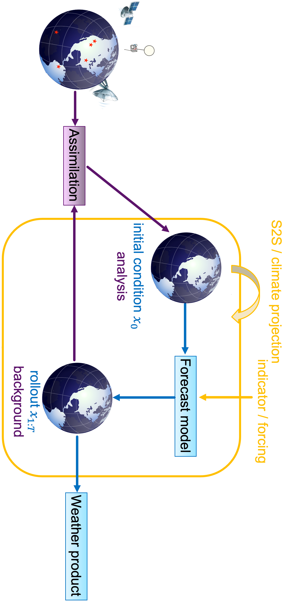
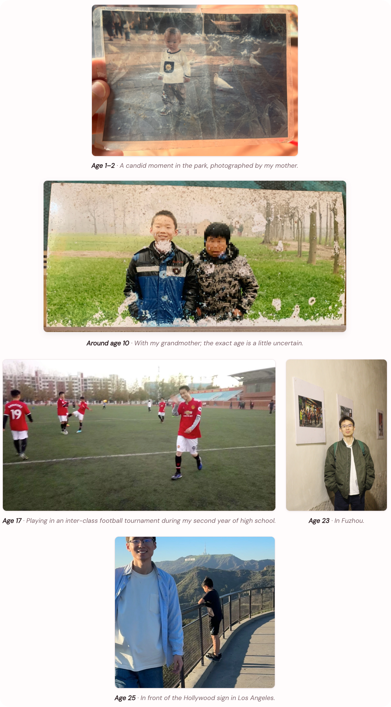

# About the Author

  
  

    
Sencan Sun 孙森灿

    
Doctoral student in Atmospheric Science 
    Department of Earth System Science, Tsinghua University

    

      <a href="mailto:ssc23@mails.tsinghua.edu.cn">ssc23@mails.tsinghua.edu.cn</a>
      <a href="https://sunmoumou1.github.io">sunmoumou1.github.io</a>
    

  

## Hello, and welcome!

I'm Sencan Sun(孙森灿), a doctoral student at Tsinghua University. My research sits where
machine learning meets atmospheric science: I work on **AI for operational
forecasting**, across data assimilation, weather, subseasonal-to-seasonal (S2S),
and climate prediction.

Fig. 0.3.1. **The assimilation–forecast cycle.** My research follows this loop from
end to end. Observations are fused with a model background through **data
assimilation** to form the analysis $x_0$; a forecast model then rolls the state
forward to $x_{1:T}$, producing weather products on the way, and the resulting
background returns to the next assimilation step. The same cycle carries
through **subseasonal-to-seasonal (S2S) and climate prediction**, where
indicators and forcings enter from above.

## My personal website

Publications, talks, news, photos, and the occasional note — everything lives
here:

  <a class="author-cta__button" href="https://sunmoumou1.github.io">
    Visit my personal website
    sunmoumou1.github.io →
  </a>

## A few moments along the way

Fig. 0.3.2. **A few moments along the way.** Personal photos at ages 1–2, around 10, 17, 23 and 25.
