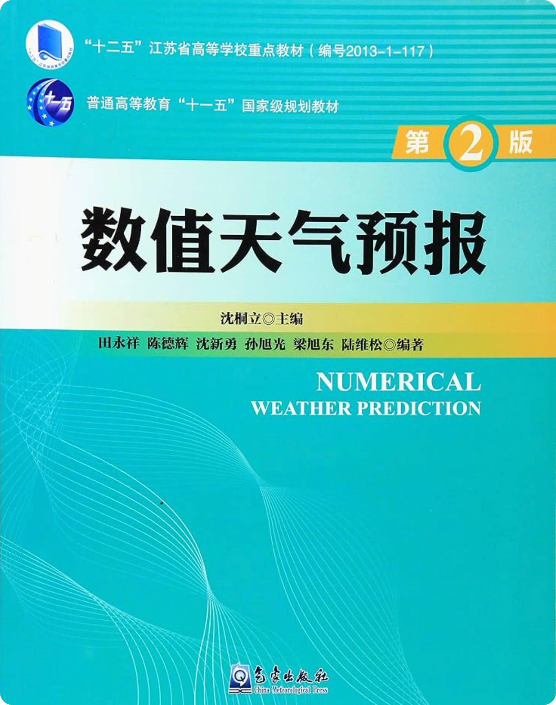
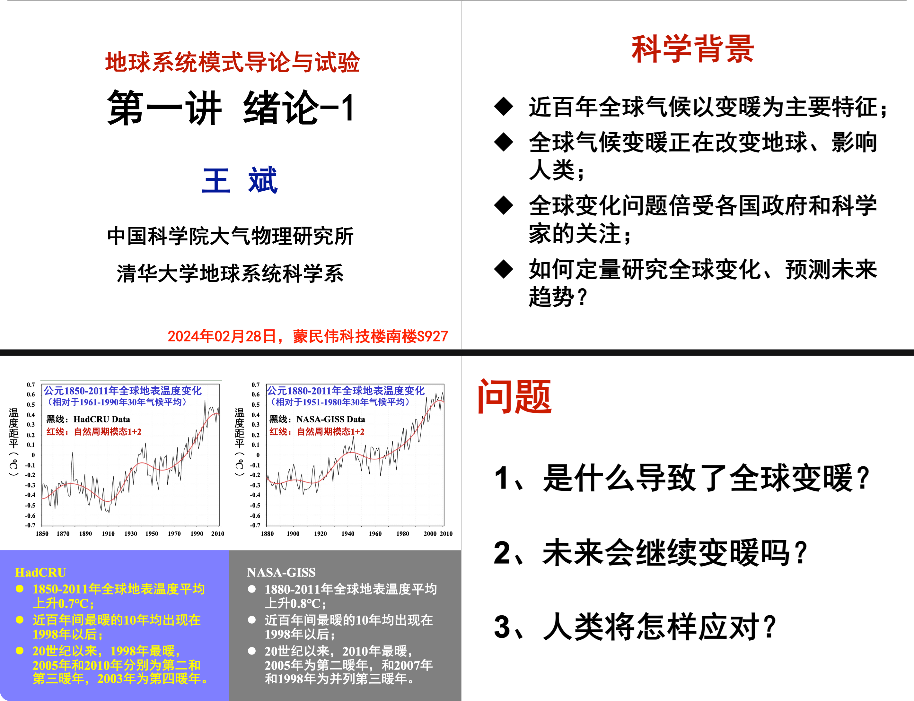
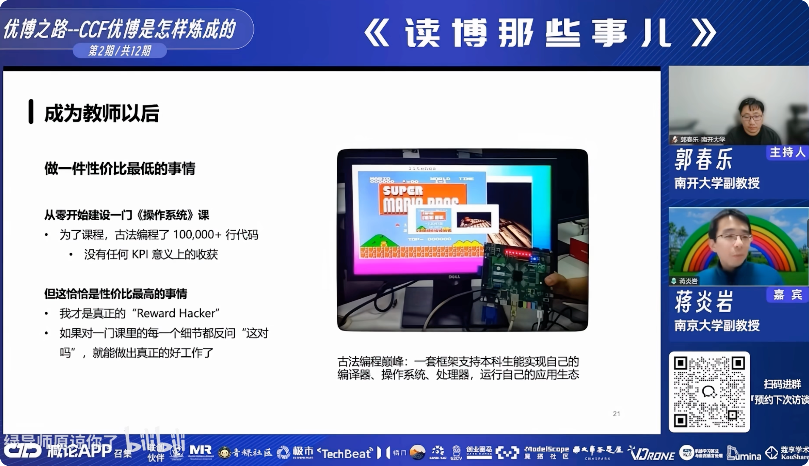

# Preface

This textbook is about **PlaSiC**, a numerical climate model I developed for teaching. PlaSiC is a model of moderate complexity: it comes with a complete codebase of roughly 20,000 lines of C, together with this textbook, which explains in detail the principles underlying the code.

This naturally raises a question: why build a model like this from scratch at all?

Developing PlaSiC demanded a great deal of effort. From the first line of code to a model that was broadly functional, the process took me nine months. Of course, I was not working on it full-time; I also had papers and other research to attend to. People often tell me that this is a thankless undertaking. Research in China is intensely competitive, and everyone is working hard to publish papers. Why devote so much time to something intended primarily for teaching — which means limited novelty — and difficult to turn into strong publications — which means little immediate return?

There are several reasons.

## 1. A regret I could never shake

> *Some regrets never quite leave you.*

One of my long-standing regrets is that I never learned how to build an NWP model from scratch.

I did my undergraduate studies at the School of Atmospheric Sciences, Nanjing University. Nanjing University places strong emphasis on mathematical and physical foundations, as well as on numerical models. I was fortunate to receive a rigorous and systematic education in atmospheric science — yet it was precisely this training that made me increasingly aware of the shortcomings in the way models are taught. Let me begin with my own experience.

My first encounter with a model came in the second semester of my sophomore year, when I took the first programming course of my life, *C Programming* (《C语言程序设计》). The final assignment was a group project: we had to develop a program in C and present it to the class. Most groups built things like the Snake game or a student information management system. My group — Lian Nayuan (连娜媛), Liu Qi (刘淇), and I — chose instead to develop a very simple model: a "Daisyworld" Earth system simulation. I remain grateful to both of them; life brings people together and then carries them apart, and we have long since lost touch.

Daisyworld offers a simple demonstration of the **Gaia hypothesis**, proposed by James Lovelock in the 1960s. The hypothesis views the Earth as having properties analogous to those of a living organism: organisms and their environment interact with and regulate one another, giving rise to a stable, self-regulating system. The more complex the components of the planet — in other words, the greater its biodiversity — the stronger its ability to withstand external disturbances.

  <figure>

    

  </figure>

  <figure>

    

  </figure>

  
Fig. 0.1.1. <strong>Our Daisyworld model.</strong> Left: the design report for the final project of the C programming course. Right: screenshots of the game interface — the start screen, the dialog for setting the initial daisy fractions, and the year-by-year simulation display.

I would like to give special thanks here to Prof. Wang Shuyu (王淑瑜) of the School of Atmospheric Sciences. At the time, Prof. Wang often sat down with us to discuss how the Daisyworld simulation should be implemented, effectively serving as our scientific advisor. Without her help, we certainly could not have completed the project.

Childish and simple as this work may look to me today, it planted a seed in my mind for the first time: the idea of simulating the Earth.

Later, in the first semester of my junior year, I began studying numerical models more systematically through *Numerical Weather Prediction* (《数值天气预报》), taught by Prof. Sun Xuguang (孙旭光). I studied hard for an entire semester, but to be honest, I only half understood the material. By the time the course was over and the summer had passed, I had forgotten almost all of it.

{ .book-cover }

Fig. 0.1.2. **The textbook we used.** 《数值天气预报》 (*Numerical Weather Prediction*, 2nd edition). The cover became very familiar over the course of that semester; unfortunately, the contents did not stay with me for nearly as long.

In the second half of 2022, during the first semester of my senior year, I was still unwilling to give up. I therefore took another course, *Atmospheric Numerical Simulation Experiments* (《大气数值模拟实验》), taught by Yang Ben (杨犇). The course focused mainly on using WRF to conduct numerical experiments, rather than on the underlying principles of numerical models.

During one lecture, the instructor mentioned that someone had used WRF to perform an idealized experiment in which entire mountain ranges were flattened. I found the idea fascinating, but at the time I had no idea how such an experiment could actually be carried out — although it seems straightforward enough to me now. Regrettably, even after completing that course, I still understood very little about how numerical models actually worked.

  <figure class="figure-row__wide">

    

  </figure>

  <figure>

    

  </figure>

  <figure>

    

  </figure>

  
Fig. 0.1.3. <strong>The follow-up course that still did not explain how a model is built.</strong> Top: my final project for the course, in which I used WRF with different cumulus convection parameterization schemes (KF and BMJ) to simulate the tracks and intensities of Northwest Pacific typhoons. Bottom left: the course slides, which introduced the basic theory and use of WRF. Bottom right: presenting the simulated typhoon tracks in class. The course taught me how to run a model, not how to build one.

In 2023, I entered the Department of Earth System Science at Tsinghua University as a direct-entry doctoral student, where I took yet another course, *Earth System Numerical Modeling* (《地球系统数值模式》). The course followed a relay format: each lecture was given by a different professor on their own area of expertise (Fig. 0.1.4). On paper, this "all-star lineup" of instructors sounded impressive. In practice, however, I found the experience disappointing — indeed, I would go so far as to call it a failure.

We were given fragments of knowledge from one lecture to the next, but never a coherent framework that tied them together. At least for me, the pieces never formed a systematic understanding. I even sometimes suspected that many of the instructors had been away from hands-on model development for so long that they no longer fully understood all of its practical details themselves.

Fig. 0.1.4. **One lecture from the relay-style course.** The first lecture of the Tsinghua course *Earth System Numerical Modeling*, given by Prof. Wang Bin (Institute of Atmospheric Physics, Chinese Academy of Sciences / Department of Earth System Science, Tsinghua University).

To summarize: I had traveled a very long road and still did not truly understand numerical models. They remained castles in the air — abstract structures that I could never quite grasp in a concrete, hands-on way.

I do not think I am alone in this. In China, and indeed around the world, there must be countless students like me: they take the courses, yet are left with only a vague understanding of models and eventually come to regard them with apprehension. After looking carefully at the teaching resources available, I concluded that there is a genuine gap. Good educational models — models that come with complete source code and a complete tutorial, that are small enough to understand yet complete in all their essential components — are extremely rare.

Starting directly with a mature system such as CESM2 is unrealistic. With millions of lines of code, no student can reasonably study and fully understand the entire system within a few months. Mature, complex models must first be distilled into something that students can actually comprehend.

So I decided to build such a tool myself.

## 2. Helping machine-learning researchers enter AI for weather and climate

My second motivation comes from the rapid development of machine learning in recent years, which has opened up a new research direction: AI for weather and climate (AIWC).

One reality of the field today is that a substantial proportion of AIWC researchers have no formal training in atmospheric science; many come instead from computer science and related disciplines. Their programming skills and understanding of AI are often excellent, but they may lack sufficient domain knowledge. In particular, many are unfamiliar with the workflow and conceptual framework of conventional numerical weather prediction. This gap is one reason some AIWC papers can look deeply puzzling from a meteorologist's perspective.

I believe one of the fastest ways to acquire that understanding is to build an NWP model yourself, from the ground up.

My hope, therefore, is that PlaSiC can serve as a teaching tool for the broader machine-learning community and help more researchers enter AIWC with a stronger understanding of the atmospheric-science foundations beneath it. In doing so, I hope it can contribute, however modestly, to the development of the AIWC community as a whole.

## 3. A bitter lesson from my own research

My third motivation comes from my own research experience. For the three years since I began my PhD in August 2023, I have been working on AIWC.

I once hoped to build a fully automated AI operational system capable of handling the entire chain from data assimilation through forecasting to prediction (see [About the Author](author.md) for details). Over the course of my research, however, I gradually came to a bitter realization: the AIWC systems of the future may still need a numerical model at their foundation — or, more precisely, as their dynamical core.

I believe PlaSiC provides a useful starting point for exploring this possibility, and in the future I may integrate PlaSiC and AI more closely. That, however, is not the focus of this textbook, so I will not dwell on my research plans here.

## 4. A pragmatic reason

My fourth reason is frankly pragmatic: I need a substantial open-source project that demonstrates what I can do.

I have interned at Caiyun Weather and at Huawei's 2012 Laboratory, working on problems related to spatiotemporal prediction. Through those experiences, I gradually came to understand a simple principle: companies ultimately care about creating value, and they therefore need the people they hire to produce useful results within a practical timeframe. In other words, you need the skills that companies actually need.

Even publishing a paper in *Nature* may not make much difference if the work is a conventional climate-analysis study of the form "under global warming, X changes, which in turn produces Y adverse impact on human society." That may be valuable academic research, but it does not necessarily demonstrate the capabilities that an employer is looking for.

At the same time, the rapid spread of AI agents and their growing capabilities is making the traditional way of evaluating programmers — asking people to write code by hand — increasingly obsolete. We used to be tested with algorithmic programming problems, but for modern AI systems many of those problems are already far too easy.

In the future, I believe that experience in designing and maintaining large software systems, managing complex projects, and operating substantial computing resources will become increasingly valuable. For these reasons, I hope PlaSiC can also become a meaningful asset on my CV.

## 5. Thanks to Prof. Jiang Yanyan

I owe special thanks to Prof. Jiang Yanyan (蒋炎岩), a professor at the School of Software, Nanjing University. Prof. Jiang is a passionate teacher who has uploaded many excellent teaching videos to Bilibili, including his operating systems course.

For that course, he did things the old-fashioned way: he wrote more than 100,000 lines of code by hand and built a framework in which undergraduates can implement their own compiler, their own operating system, and their own processor — and then run their own application ecosystem on top of them.

Prof. Jiang has said that, from the perspective of conventional academic research, this is about the least cost-effective thing one could possibly do. Teaching, after all, is often undervalued by university faculty in China. Yet for him, it is precisely the most worthwhile investment.

That attitude inspired me deeply and became an important motivation for developing PlaSiC.

Fig. 0.1.5. **"The least cost-effective thing one can do" — and yet the most cost-effective.** Prof. Jiang Yanyan, School of Software, Nanjing University, speaking in the talk series *Things about Doing a PhD* (《读博那些事儿》). For his operating systems course, he wrote more than 100,000 lines of code and built a framework in which undergraduates can implement their own compiler, operating system, and processor, and then run their own application ecosystem.

## Closing words

For all of these reasons, I developed PlaSiC. A detailed introduction to the model can be found in the [PlaSiC Online Tutorial](index.md), so I will leave the technical details to the tutorial itself.

Finally, I would like to thank the teachers who helped me along the way — and also to thank myself for piecing together this project over the past nine months. Had I been able to work on PlaSiC full-time, it certainly would not have taken nine months. But I also had formal research responsibilities to fulfill, so most of the work had to be done in whatever fragments of time I could carve out around everything else.

I hope PlaSiC will be useful to a wider community.

Thank you.
